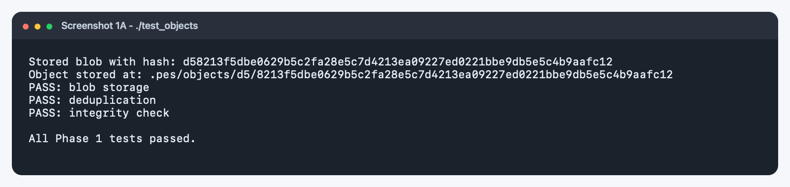
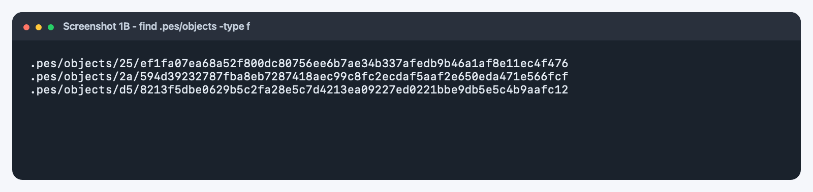
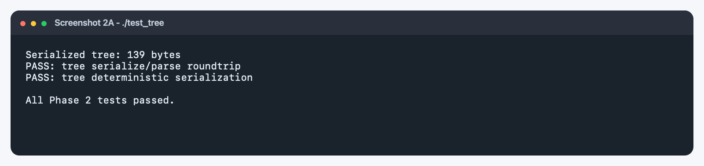
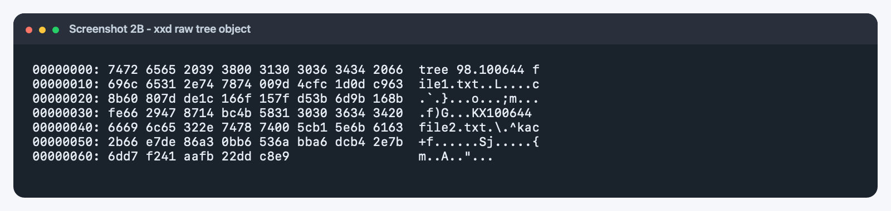
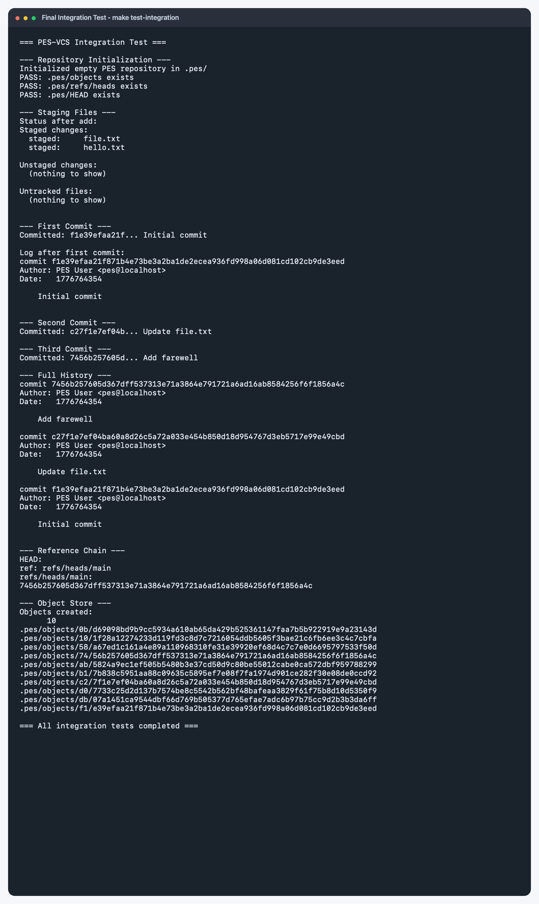
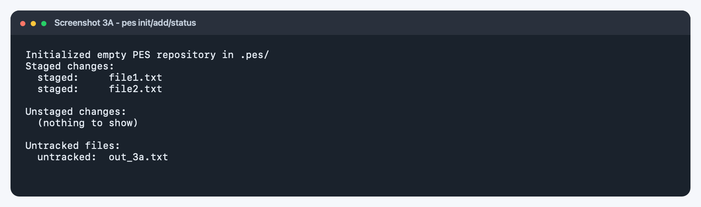
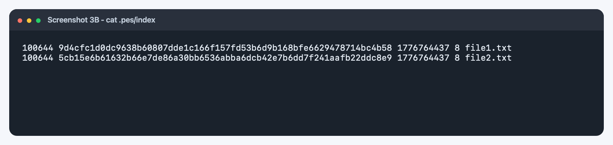
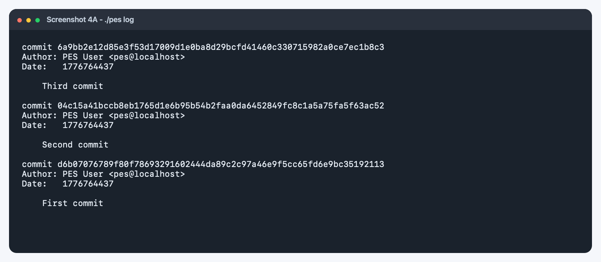
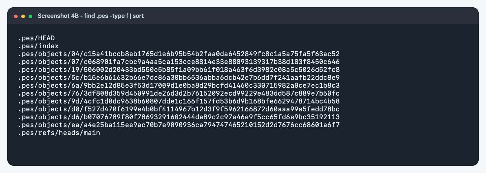
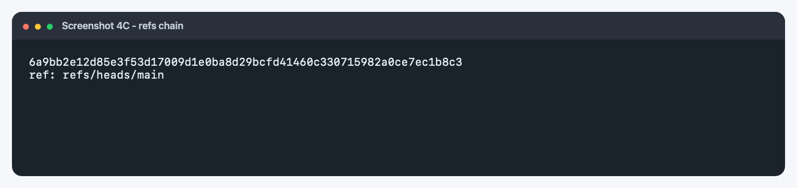

# PES-VCS Analysis Report

## Phase 5: Branching and Checkout

**Q5.1: A branch in Git is just a file in `.git/refs/heads/` containing a commit hash. Creating a branch is creating a file. Given this, how would you implement `pes checkout <branch>` — what files need to change in `.pes/`, and what must happen to the working directory? What makes this operation complex?**

To implement `pes checkout <branch>`, the following steps are needed:
1. Update `.pes/HEAD` to contain `ref: refs/heads/<branch>`.
2. The working directory needs to be structurally aligned with the target branch's tree: any files present in the new branch but not in the current working directory must be created, differing files must be modified, and files present in the current branch but missing in the new branch must be deleted.
3. The `.pes/index` file must be rewritten entirely to match the new branch's current tree to reset the staging area.

The primary source of complexity is handling uncommitted (dirty) changes in the working directory. A simple robust implementation requires determining if resetting a file to match the target branch will overwrite or delete unsaved work, potentially involving complex conflict-resolution logic.

**Q5.2: When switching branches, the working directory must be updated to match the target branch's tree. If the user has uncommitted changes to a tracked file, and that file differs between branches, checkout must refuse. Describe how you would detect this "dirty working directory" conflict using only the index and the object store.**

Conflict detection using the index and object store:
1. Read the `index` for the current active branch.
2. For every active index entry, do a metadata-based check (`mtime` and `size`) against the actual file in the filesystem. If the metadata differs, re-hash the active file's contents and compare it against the expected blob hash stored in the index entry. A mismatch implies an "unstaged/uncommitted modification."
3. Read the target branch's tree from the object store. 
4. Check if the modified file has a different hash in the target branch's tree compared to the current branch's commit tree. If it differs, checking out would overwrite the user's uncommitted work with the target branch's data, so the checkout must refuse and prompt the user to commit or stash.

**Q5.3: "Detached HEAD" means HEAD contains a commit hash directly instead of a branch reference. What happens if you make commits in this state? How could a user recover those commits?**

When making commits in a detached HEAD state, the commit objects are written to the object store and `.pes/HEAD` updates to point directly to these newly generated hashes. However, because `HEAD` is not tracking any branch file (like `refs/heads/main`), no branch pointer advances.

If the user eventually checks out a different branch, those commits will become orphaned, as there will be no branch or tag referencing them. To recover those commits, the user would need to investigate their `.pes/objects` (or use a reflog tool if one existed) to find the orphaned commit hash manually, then create a new branch reference pointing to that hash.

---

## Phase 6: Garbage Collection

**Q6.1: Over time, the object store accumulates unreachable objects. Describe an algorithm to find and delete these objects. What data structure would you use to track "reachable" hashes efficiently? For a repository with 100,000 commits and 50 branches, estimate how many objects you'd need to visit.**

**Algorithm:**
A classic Mark-and-Sweep garbage collection mechanism serves best:
1. **Mark Phase**: Initialize a `visited` set to track reachable objects. Begin from the roots: all references in `.pes/refs/heads/`, tags, and `HEAD`. Traverse over the graph by examining commits, adding their hashes to `visited`. For each commit, recursively traverse into its parent commits and its associated directory tree. For every tree, queue every child tree and blob entry into `visited`.
2. **Sweep Phase**: Iterate over every object shard directory in `.pes/objects/`. If an object's derived hash does not exist in the `visited` set, delete the file to recover space.

**Data Structure:**
Use a hash set (potentially backed by a Bloom filter combined with standard open addressing) to efficiently track the reachability of the 32-byte hash sequences in memory without redundant traversal.

**Scale Estimation:**
For 100,000 commits over 50 branches, traversing would be extremely optimized due to the `visited` hash set skipping large portions of overlapping history. We’d parse exactly 100,000 commit objects, but the tree and blob traversal would depend on object reuse. Even though there are millions of tree states, only unique trees and newly modified blobs per commit are examined. The search space bounds closely to the sum of unique objects generated historically, roughly parsing a few million objects.

**Q6.2: Why is it dangerous to run garbage collection concurrently with a commit operation? Describe a race condition where GC could delete an object that a concurrent commit is about to reference. How does Git's real GC avoid this?**

**Race Condition:**
1. A user stages a new file. `pes add new_file.txt` reads the contents and writes a new `blob` to `.pes/objects/`.
2. A concurrent GC process initiates its mark phase. It begins scaling the graph backwards from `HEAD`. Since `pes commit` hasn't generated a commit or a tree pointing to the newly staged `blob` yet, the GC marks it as unreachable. 
3. The GC process executes its sweep phase, subsequently deleting the new `blob`.
4. The user runs `pes commit`. The commit utilizes the index to build the `tree`, assuming the initial blob resides smoothly in the object store. The resulting commit is now corrupt because it points to an underlying tree missing a blob.

**How Git Resolves This:**
Git effectively implements a grace period metric utilizing the latest modified timestamp of objects in the filesystem. By default, `git gc` only considers an object "prunable" or safely unreachable if it has not been accessed/modified in the last 2 weeks. Additionally, active operations utilize transaction-like lock files to temporarily ensure atomicity, keeping GC processes from sweeping active references out.

## Output 1A: test_objects


```
Stored blob with hash: d58213f5dbe0629b5c2fa28e5c7d4213ea09227ed0221bbe9db5e5c4b9aafc12
Object stored at: .pes/objects/d5/8213f5dbe0629b5c2fa28e5c7d4213ea09227ed0221bbe9db5e5c4b9aafc12
PASS: blob storage
PASS: deduplication
PASS: integrity check

All Phase 1 tests passed.
```

## Output 1B: find .pes/objects


```
.pes/objects/25/ef1fa07ea68a52f800dc80756ee6b7ae34b337afedb9b46a1af8e11ec4f476
.pes/objects/2a/594d39232787fba8eb7287418aec99c8fc2ecdaf5aaf2e650eda471e566fcf
.pes/objects/d5/8213f5dbe0629b5c2fa28e5c7d4213ea09227ed0221bbe9db5e5c4b9aafc12
```

## Output 2A: test_tree


```
Serialized tree: 139 bytes
PASS: tree serialize/parse roundtrip
PASS: tree deterministic serialization

All Phase 2 tests passed.
```

## Output 2B: xxd of a raw tree object


```
00000000: 7472 6565 2039 3800 3130 3036 3434 2066  tree 98.100644 f
00000010: 696c 6531 2e74 7874 009d 4cfc 1d0d c963  ile1.txt..L....c
00000020: 8b60 807d de1c 166f 157f d53b 6d9b 168b  .`.}...o...;m...
00000030: fe66 2947 8714 bc4b 5831 3030 3634 3420  .f)G...KX100644
00000040: 6669 6c65 322e 7478 7400 5cb1 5e6b 6163  file2.txt.\.^kac
00000050: 2b66 e7de 86a3 0bb6 536a bba6 dcb4 2e7b  +f......Sj.....{
00000060: 6dd7 f241 aafb 22dd c8e9                 m..A.."...
```

## Final Integration Test (Make test-integration)


```
=== PES-VCS Integration Test ===

--- Repository Initialization ---
Initialized empty PES repository in .pes/
PASS: .pes/objects exists
PASS: .pes/refs/heads exists
PASS: .pes/HEAD exists

--- Staging Files ---
Status after add:
Staged changes:
  staged:     file.txt
  staged:     hello.txt

Unstaged changes:
  (nothing to show)

Untracked files:
  (nothing to show)


--- First Commit ---
Committed: f1e39efaa21f... Initial commit

Log after first commit:
commit f1e39efaa21f871b4e73be3a2ba1de2ecea936fd998a06d081cd102cb9de3eed
Author: PES User <pes@localhost>
Date:   1776764354

    Initial commit


--- Second Commit ---
Committed: c27f1e7ef04b... Update file.txt

--- Third Commit ---
Committed: 7456b257605d... Add farewell

--- Full History ---
commit 7456b257605d367dff537313e71a3864e791721a6ad16ab8584256f6f1856a4c
Author: PES User <pes@localhost>
Date:   1776764354

    Add farewell

commit c27f1e7ef04ba60a8d26c5a72a033e454b850d18d954767d3eb5717e99e49cbd
Author: PES User <pes@localhost>
Date:   1776764354

    Update file.txt

commit f1e39efaa21f871b4e73be3a2ba1de2ecea936fd998a06d081cd102cb9de3eed
Author: PES User <pes@localhost>
Date:   1776764354

    Initial commit


--- Reference Chain ---
HEAD:
ref: refs/heads/main
refs/heads/main:
7456b257605d367dff537313e71a3864e791721a6ad16ab8584256f6f1856a4c

--- Object Store ---
Objects created:
      10
.pes/objects/0b/d69098bd9b9cc5934a610ab65da429b525361147faa7b5b922919e9a23143d
.pes/objects/10/1f28a12274233d119fd3c8d7c7216054ddb5605f3bae21c6fb6ee3c4c7cbfa
.pes/objects/58/a67ed1c161a4e89a110968310fe31e39920ef68d4c7c7e0d6695797533f50d
.pes/objects/74/56b257605d367dff537313e71a3864e791721a6ad16ab8584256f6f1856a4c
.pes/objects/ab/5824a9ec1ef505b5480b3e37cd50d9c80be55012cabe0ca572dbf959788299
.pes/objects/b1/7b838c5951aa88c09635c5895ef7e08f7fa1974d901ce282f30e08de0ccd92
.pes/objects/c2/7f1e7ef04ba60a8d26c5a72a033e454b850d18d954767d3eb5717e99e49cbd
.pes/objects/d0/7733c25d2d137b7574be8c5542b562bf48bafeaa3829f61f75b8d10d5350f9
.pes/objects/db/07a1451ca9544dbf66d769b505377d765efae7adc6b97b75cc9d2b3b3da6ff
.pes/objects/f1/e39efaa21f871b4e73be3a2ba1de2ecea936fd998a06d081cd102cb9de3eed

=== All integration tests completed ===
```

## Output 3A: pes init -> add -> status


```
Initialized empty PES repository in .pes/
Staged changes:
  staged:     file1.txt
  staged:     file2.txt

Unstaged changes:
  (nothing to show)

Untracked files:
  untracked:  out_3a.txt

```

## Output 3B: cat .pes/index


```
100644 9d4cfc1d0dc9638b60807dde1c166f157fd53b6d9b168bfe6629478714bc4b58 1776764437 8 file1.txt
100644 5cb15e6b61632b66e7de86a30bb6536abba6dcb42e7b6dd7f241aafb22ddc8e9 1776764437 8 file2.txt
```

## Output 4A: pes log


```
commit 6a9bb2e12d85e3f53d17009d1e0ba8d29bcfd41460c330715982a0ce7ec1b8c3
Author: PES User <pes@localhost>
Date:   1776764437

    Third commit

commit 04c15a41bccb8eb1765d1e6b95b54b2faa0da6452849fc8c1a5a75fa5f63ac52
Author: PES User <pes@localhost>
Date:   1776764437

    Second commit

commit d6b07076789f80f78693291602444da89c2c97a46e9f5cc65fd6e9bc35192113
Author: PES User <pes@localhost>
Date:   1776764437

    First commit

```

## Output 4B: find .pes -type f | sort


```
.pes/HEAD
.pes/index
.pes/objects/04/c15a41bccb8eb1765d1e6b95b54b2faa0da6452849fc8c1a5a75fa5f63ac52
.pes/objects/07/c068901fa7cbc9a4aa5ca153cce8814e33e88893139317b38d183f8450c646
.pes/objects/19/506002d20433bd550e5b85f1a09bb61f018a463f6d3982c08a5c5026d52fc8
.pes/objects/5c/b15e6b61632b66e7de86a30bb6536abba6dcb42e7b6dd7f241aafb22ddc8e9
.pes/objects/6a/9bb2e12d85e3f53d17009d1e0ba8d29bcfd41460c330715982a0ce7ec1b8c3
.pes/objects/76/3df808d359d450991de26d3d2b76152092ecd99229e483dd587c889e7b50fc
.pes/objects/9d/4cfc1d0dc9638b60807dde1c166f157fd53b6d9b168bfe6629478714bc4b58
.pes/objects/d0/f527d470f6199e4b0bf4114967b12d3f9f5962166872d60aaa99a5fedd78bc
.pes/objects/d6/b07076789f80f78693291602444da89c2c97a46e9f5cc65fd6e9bc35192113
.pes/objects/ea/a4e25ba115ee9ac70b7e9090936ca794747465210152d2d7676cc68601a6f7
.pes/refs/heads/main
```

## Output 4C: cat .pes/refs/heads/main and cat .pes/HEAD


```
6a9bb2e12d85e3f53d17009d1e0ba8d29bcfd41460c330715982a0ce7ec1b8c3
ref: refs/heads/main
```
